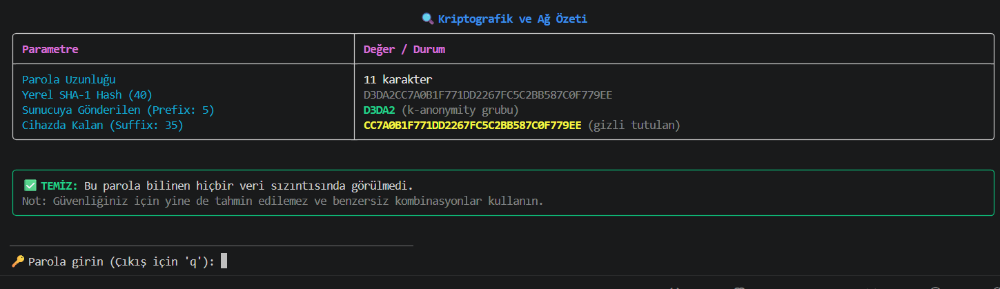
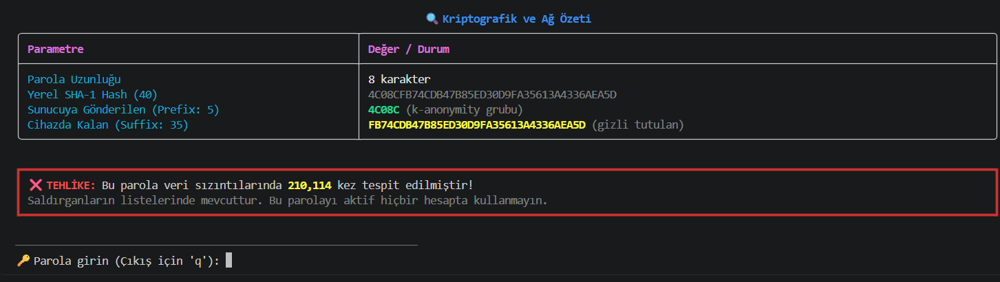

# 🛡️ LeakSentry

> **k-Anonymity** matematiksel gizlilik modeli ve **Have I Been Pwned (HIBP)** API'si kullanarak yerel parola sızıntı kontrolü yapan modern CLI güvenlik aracı.

---

## 📌 Proje Hakkında

**LeakSentry**, girdiğiniz parolaların geçmiş veri ihlallerinde (*data breaches*) yer alıp almadığını kontrol eden hafif, interaktif ve güvenli bir komut satırı aracıdır.

Geleneksel yaklaşımların aksine parola hiçbir zaman düz metin (*plaintext*) veya tam hash olarak internete gönderilmez. LeakSentry, **k-Anonymity** yaklaşımı sayesinde parola kontrolünü mümkün olduğunca az bilgi açığa çıkararak gerçekleştirir.

---

## 📸 Ekran Görüntüleri

<p align="center">
  
</p>

<p align="center">
  <strong>✅ Güvenli Parola — Sızıntı bulunmadı</strong>
</p>

<br>

<p align="center">
  
</p>

<p align="center">
  <strong>⚠️ Sızdırılmış Parola — Veri ihlalinde bulundu</strong>
</p>

---

## 🔐 k-Anonymity Modeli Nasıl Çalışır?

Geleneksel ve riskli yaklaşımda kontrol edilmek istenen parola doğrudan bir sunucuya gönderilebilir. LeakSentry ise bu riski **k-Anonymity** mimarisiyle azaltır.

### 1. Yerel Özetleme — SHA-1

Parola cihazınızda `SHA-1` algoritması kullanılarak 40 karakterlik bir hash değerine dönüştürülür.

### 2. Ön Ek Gönderimi — Prefix

Üretilen hash'in yalnızca **ilk 5 karakteri** HIBP Pwned Passwords Range API'sine gönderilir.

Sunucu, bu 5 karakterle başlayan olası sızdırılmış hash'lerin listesini döndürür.

### 3. Yerel Kuyruk Eşleştirme — Suffix

Hash'in cihazda tutulan kalan **35 karakterlik kısmı**, API'den dönen sonuçlar içerisinde yerel olarak aranır.

### 4. Sıfır İfşa

Gerçek parola veya **40 karakterlik tam hash değeri** ağ üzerinden gönderilmez.

> 🔒 Böylece HIBP sunucusu hangi parolayı kontrol ettiğinizi doğrudan öğrenemez.

---

## 🚀 Kurulum

### 1. Depoyu Klonlayın

```bash
git clone https://github.com/mlkaydemir/LeakSentry.git
cd LeakSentry
```

### 2. Bağımlılıkları Yükleyin

Gerekli Python paketlerini yüklemek için:

```bash
pip install -r requirements.txt
```

---

## 💻 Kullanım

Aracı başlatmak için terminalde aşağıdaki komutu çalıştırın:

```bash
python leak_checker.py
```

### Özellikler

* **🔒 Maskelenmiş Giriş:** Parola girilirken karakterler ekranda `*` olarak görüntülenir.
* **♻️ İnteraktif Çalışma:** Programı yeniden başlatmadan birden fazla parola sorgulayabilirsiniz.
* **🛑 Güvenli Çıkış:** Uygulamadan çıkmak için `q` yazıp **Enter**'a basabilir veya `CTRL + C` kısayolunu kullanabilirsiniz.

---

## 🛠️ Kullanılan Teknolojiler

| Teknoloji          | Kullanım Amacı                                        |
| ------------------ | ----------------------------------------------------- |
| **Python 3.10+**   | Uygulamanın temel geliştirme dili                     |
| **Rich**           | Terminal panelleri, tablolar ve durum göstergeleri    |
| **prompt_toolkit** | Maskeli parola girişi ve interaktif terminal yönetimi |
| **Requests**       | HIBP Pwned Passwords Range API ile iletişim           |
| **hashlib**        | Yerel SHA-1 hash üretimi                              |

---

## 🔒 Güvenlik Yaklaşımı

LeakSentry'nin temel güvenlik prensibi, **parolanın kendisini veya tam hash değerini dış sisteme göndermemektir.**

Kontrol süreci:

```text
Parola
   │
   ▼
SHA-1 Hash
   │
   ├──────────────► İlk 5 karakter ──────► HIBP API
   │
   └──────────────► Son 35 karakter
                            │
                            ▼
                    Yerel Eşleştirme
                            │
                            ▼
                     Sonuç Gösterimi
```

Bu mimari sayesinde API'ye yalnızca hash'in küçük bir bölümü gönderilir ve eşleştirme işleminin kritik kısmı yerel olarak gerçekleştirilir.

---

## ⚖️ Lisans

Bu proje **MIT Lisansı** altında sunulmaktadır.

Ayrıntılı lisans koşulları için [`LICENSE`](LICENSE) dosyasına göz atabilirsiniz.
